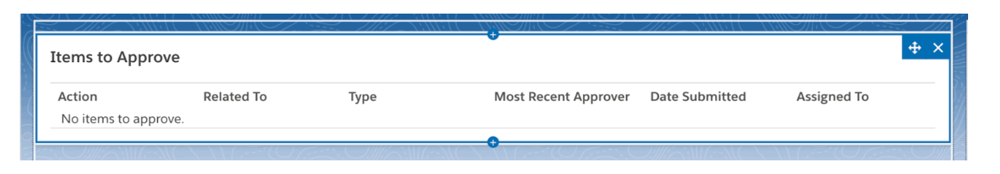

# Approval Console V1 

## Description: 
Component that shows items that were in a queue that the user was assigned to.  This component was built so that a user can  Approve/Reject/Reassign. A pop up modal will ask for comments when rejecting or approving. 
Component is built to handle any object’s approval. 

## Screenshots:

### Empty Approval Console:

## Design Attributes:

n/a

## Version

### Version 1

* Core Functionality

## Components:

### Aura:

* CH_ApprovalItems
* CH_ApprovalItems_Modal

### Label:

* CH_ApprovalItems_Related_To
* CH_ApprovalItems_Title
* CH_ApprovalItems_Action
* CH_ApprovalItems_Type
* CH_ApprovalItems_MostRecentApprover
* CH_ApprovalItems_DateSubmitted
* CH_ApprovalItems_Reassign
* CH_ApprovalItems_NoItemsToApprove
* CH_ApprovalItems_AssignedTo
* CH_ApprovalItems_Approve
* CH_ApprovalItems_Reject

### Apex: 

* CH_CTRL_ApprovalItems
* CH_CTRL_ApprovalItems_Test

## Dependencies: 

### Apex:

	(Install sObject Factory from SRA Project - ssh://git@bitbucket.coke.com:22/sra/sobject-factory.git )

## Steps to Reuse:

Drag and Drop no customization needed for all objects, except for KAV has an additional field IH_Article_Status__c. 

Verify Dependencies are added
Suggestions for Future Updates:
Filters on the component. 

